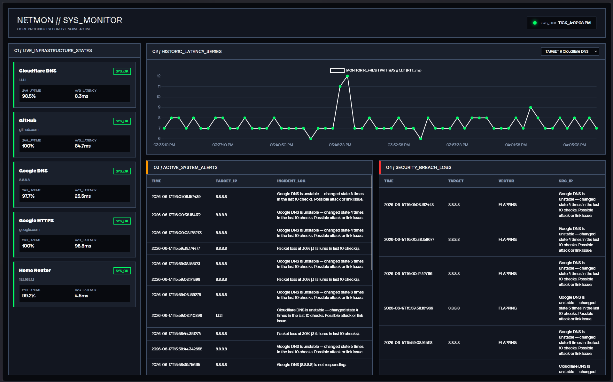
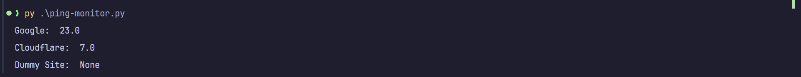
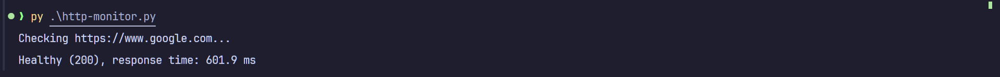
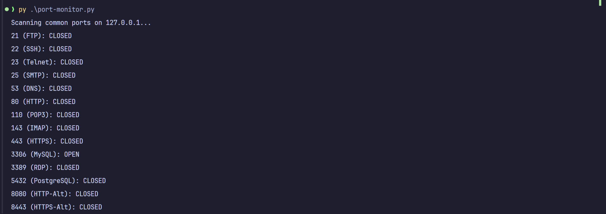
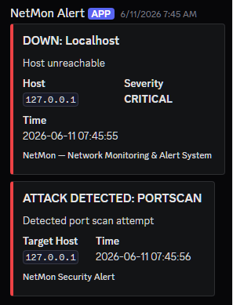
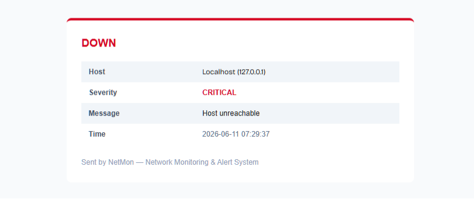

# NetMon - Network Monitoring & Alert System

A network health monitor that keeps tabs on your hosts and services. It watches for problems, alerts you when something goes wrong, and keeps a log of everything that happens.
Built with Python. Works on Windows, macOS, and Linux.

> **Note:** This project is still being worked on. It's not finished yet and isn't ready to use in production. Stuff might break or change without warning.

---

## What's Done

- **Monitoring** - Pings hosts, checks if HTTP services are responding, and monitors specific ports
- **Problem detection** - Spots when hosts go down, latency gets bad, there's packet loss, HTTP errors happen, or ports randomly open/close
- **Alerts** - Sends notifications to Discord and email when things break
- **Database storage** - Keeps all the metrics and alert history in SQLite so you can look back at what happened
- **Scheduler** - Runs checks regularly on all your targets without blocking each other

---

## Tech Stack

| Part      | What we used                               |
| --------- | ------------------------------------------ |
| Monitor   | Python (ping), sockets, HTTP requests      |
| Scheduler | APScheduler - runs tasks on a timer        |
| Storage   | SQLite - simple database built into Python |
| Alerts    | Discord Webhooks, Gmail SMTP               |
| Detection | Custom code that spots problems            |

---

## What's Included

- **Ping monitor** - Checks if hosts respond and how fast
- **HTTP monitor** - Tests web services and measures response time
- **Port monitor** - Watches specific ports for changes
- **8 different detectors** - Looks for host downtime, latency spikes, packet loss, bad HTTP responses, slow responses, port changes, and weird behavior patterns
- **Multi-channel alerts** - Gets you notifications on Discord and email

---

## Project Structure

A breakdown of the repository layout, mapping out the core application layers from data collection to the presentation dashboard.

netmon/
│
├── main.py                 # ENTRY POINT — run this to start everything
├── config.py               # all settings: hosts, thresholds, secrets
├── scheduler.py            # polling engine: pings targets every 30s
├── requirements.txt        # pip package list
├── .env                    # your secrets (never commit this)
├── .env.example            # template for .env
├── .gitignore              # tells Git to ignore .env, logs/, data/
│
├── monitor/                # data collection layer
│   ├── _init_.py
│   ├── ping_monitor.py     # ICMP ping (cross-platform)
│   ├── port_monitor.py     # TCP port checker
│   └── http_monitor.py     # HTTP/HTTPS response checker
│
├── database/               # persistence layer
│   ├── _init_.py
│   └── database.py               # SQLite: create, read, write
│
├── alerts/                 # notification layer
│   ├── _init_.py
│   ├── discord_alert.py    # Discord webhook embeds
│   └── email_alert.py      # Gmail SMTP HTML email
│
├── detection/              # analysis layer
│   ├── _init_.py
│   └── anomaly.py          # rolling-average anomaly engine
│
├── dashboard/              # presentation layer
│   ├── _init_.py
│   ├── app.py              # Flask + SocketIO server
│   └── templates/
│       └── index.html      # live dashboard UI
│
├── sql/                    # Sql command for the dashboard
│   ├── create-alerts.sql
│   ├── create-attack-events.sql
│   ├── create-metrics.sql
│   ├── get-attack-events.sql
│   ├── get-current-status.sql
│   ├── get-host-status.sql
│   ├── get-recent-alerts.sql
│   ├── get-rtt-history.sql
│   ├── insert-alert.sql
│   ├── insert-attack-events.sql
│   ├── insert-metric.sql
│
├── logs/
│   └── monitor.log         # all events logged here
└── data/
    └── monitor.db          # SQLite database file

---

## Dashboard Interface

The **NetMon Dashboard** provides a real-time monitoring interface. It visualizes your network health, tracks latency history, and logs security events in an easy-to-read, clean layout.

#### Dashboard Highlights:

- **Live Host Matrix:** Instant visual feedback on system state with `SYS_OK` and `SYS_FAIL` indicators.
- **Time-Series Telemetry:** Interactive line charts for monitoring RTT latency trends over time.
- **Security Breach Logs:** Centralized tracking of network anomalies, port scans, and flapping services.
- **Real-time Updates:** Powered by **Flask-SocketIO**, the dashboard updates automatically without requiring a page refresh.

---

## What It Looks Like

### Ping Monitor

### HTTP Monitor

### Port Monitor

### Discord Alerts

### Email Alerts

---

## Getting Started

1. **Set up Python** - Make sure you have Python 3.9+ installed
2. **Install dependencies** - Run `pip install -r requirements.txt`
3. **Configure targets** - Edit `config.py` and add the hosts you want to monitor
4. **Set up alerts** - Add your Discord webhook and email settings to a `.env` file
5. **Run it** - Execute `netmon.py` to start the program

All your metrics and alerts get saved to the database, and you can look back at what happened whenever you want.

---

## Typography

This project uses **Apfel Grotezk**, a high-quality open-source typeface designed by Collletttivo.

**Font License:** Apfel Grotezk is licensed under the [SIL Open Font License (OFL) v1.1](https://scripts.sil.org/OFL)

- **Author:** Collletttivo (https://www.collletttivo.it/)
- **License:** SIL Open Font License v1.1
- **Font Files Location:** `dashboard/templates/fonts/apfel-grotezk-main/`

---

## The Team

1. Bikram Timalsina
2. Karan Bhatt
3. Rojan Tamang
4. Sushant Ale Magar
